# Titanic Survival Prediction with Machine Learning

End-to-end machine learning pipeline for predicting Titanic passenger survival using exploratory data analysis, feature engineering, preprocessing, model comparison, SMOTE analysis, and hyperparameter tuning.

## Overview

This project builds a supervised classification pipeline for the Titanic survival prediction task. The goal is to predict whether a passenger survived based on passenger demographics, ticket information, family relationships, fare, class, cabin/deck information, and engineered features.

The project goes beyond direct model fitting by including:

- missing-value analysis and imputation strategy,
- outlier inspection and treatment decisions,
- exploratory visualization,
- feature transformation and encoding,
- class-imbalance review,
- model comparison,
- SMOTE experiment,
- GridSearchCV hyperparameter tuning.

## Dataset

| Item | Value |
|---|---:|
| Dataset | Titanic passenger survival data |
| Rows | 891 |
| Target | `Survived` |
| Original survival distribution | 549 did not survive / 342 survived |
| Train/test split | 80% / 20% stratified |
| Training rows | 712 |
| Test rows | 179 |
| Final feature matrix | 21 features |

## Machine Learning Objective

The task is a binary supervised classification problem:

| Class | Meaning |
|---|---|
| 0 | Did not survive |
| 1 | Survived |

## Project Pipeline

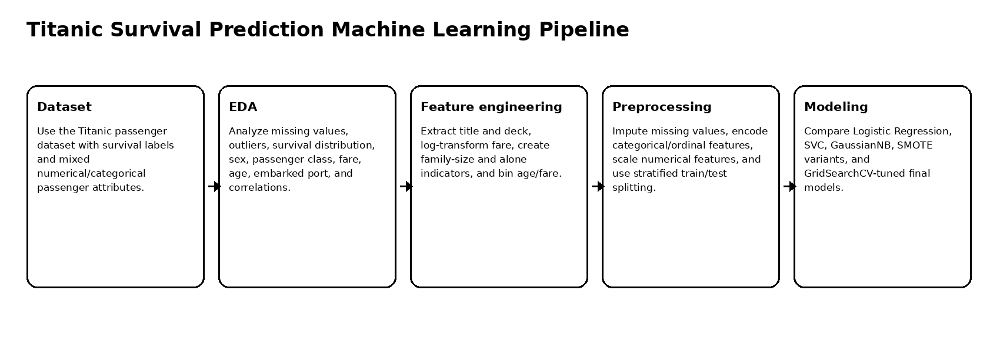

## Exploratory Data Analysis

The EDA investigates missing values, outliers, feature distributions, and survival-related patterns.

| Missing values | Outlier boxplots |
|---|---|
| 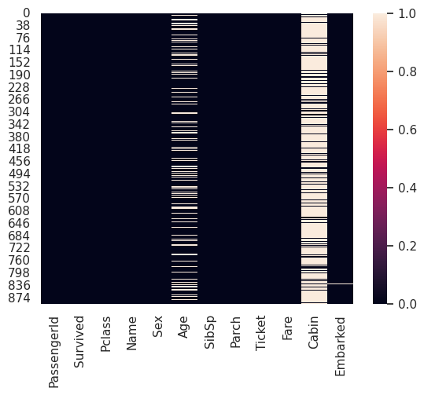 | 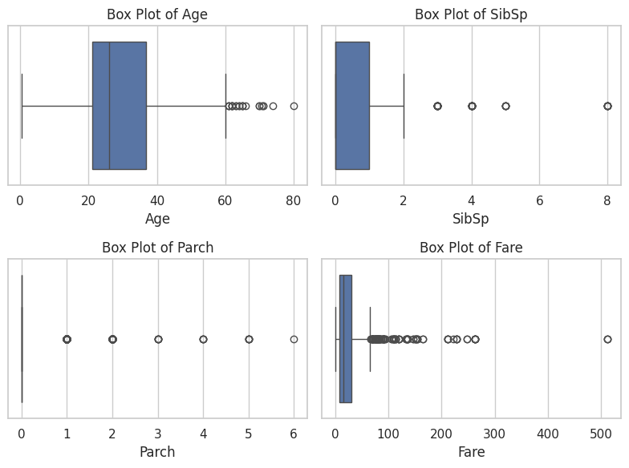 |

| Survival distribution | Survival by sex |
|---|---|
| 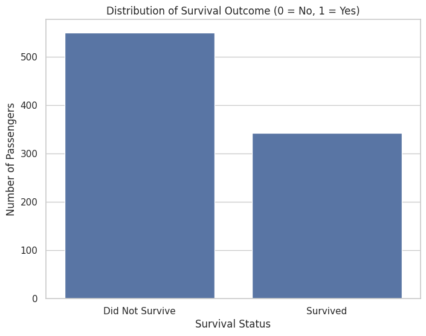 | 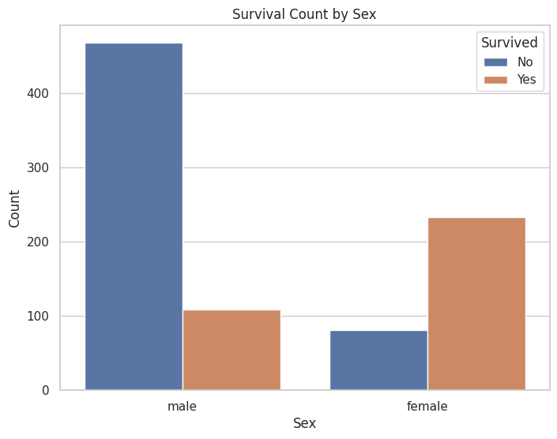 |

| Survival by passenger class | Age distribution by survival |
|---|---|
| 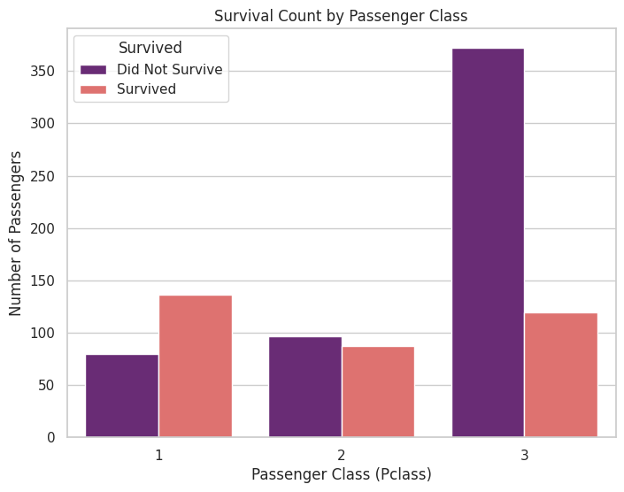 | 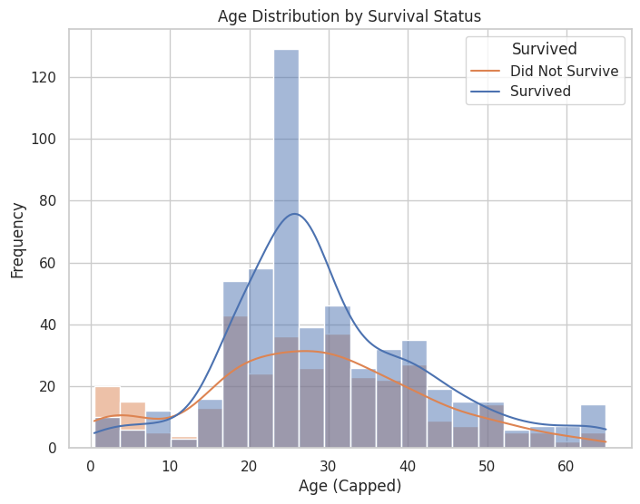 |

## Key EDA Findings

1. Survival was imbalanced: more passengers did not survive than survived.
2. Sex was highly predictive, with females showing a much higher survival rate than males.
3. Passenger class was strongly associated with survival, with first-class passengers having better outcomes.
4. Fare was skewed and correlated with passenger class.
5. Age contained missing values and required a more careful imputation strategy than a simple global mean.
6. Cabin had many missing values, so a deck-based feature was engineered instead of relying on raw cabin values.

## Feature Engineering

The project engineered several features before model training:

| Feature | Purpose |
|---|---|
| `Title` | Extracts social titles from passenger names and supports age imputation |
| `Deck` | Uses the first cabin letter or missing marker to summarize cabin location |
| `Fare_log` | Reduces skewness in the fare distribution |
| `FamilySize` | Combines siblings/spouses and parents/children |
| `IsAlone` | Flags passengers traveling alone |
| `AgeBin` | Converts age into ordered groups |
| `FareBin` | Converts fare into ordered groups |

| Fare distribution | Fare after log transform |
|---|---|
| 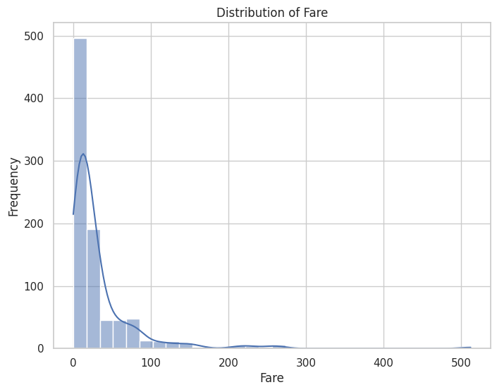 | 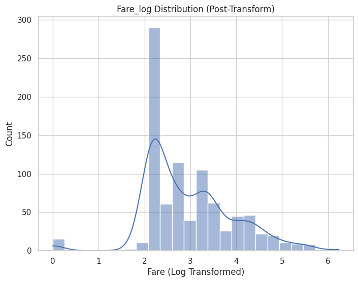 |

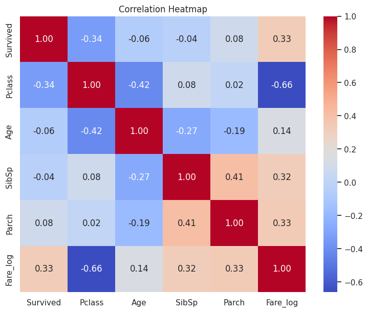

## Preprocessing

The preprocessing workflow includes:

- median age imputation by passenger class and title,
- deck feature extraction from cabin,
- mode imputation for embarked port,
- label encoding for sex,
- one-hot encoding for embarked, title, and deck,
- ordinal encoding for age and fare bins,
- scaling numerical features,
- stratified train/test splitting.

## Class Imbalance and SMOTE

The target split was approximately 60/40, so the imbalance was moderate rather than severe. A SMOTE experiment was included after the train/test split to avoid data leakage.

SMOTE improved survivor recall in some cases but reduced precision and did not clearly improve the overall model balance. The final direction prioritized tuned Logistic Regression and SVC without relying on SMOTE.

## Model Comparison

The project compared:

- Logistic Regression
- Support Vector Machine
- Gaussian Naive Bayes
- SMOTE-based variants
- Tuned Logistic Regression with GridSearchCV
- Tuned SVC with GridSearchCV

| Model | Setup | Accuracy | Survivor Precision | Survivor Recall | Survivor F1 |
|---|---|---:|---:|---:|---:|
| Logistic Regression | Baseline | 0.83 | 0.77 | 0.78 | 0.78 |
| SVC | Baseline | 0.84 | 0.82 | 0.74 | 0.78 |
| GaussianNB | Baseline | 0.74 | 0.61 | 0.86 | 0.72 |
| Logistic Regression | Tuned | 0.838 | 0.79 | 0.78 | 0.79 |
| SVC | Tuned | 0.838 | 0.82 | 0.74 | 0.78 |

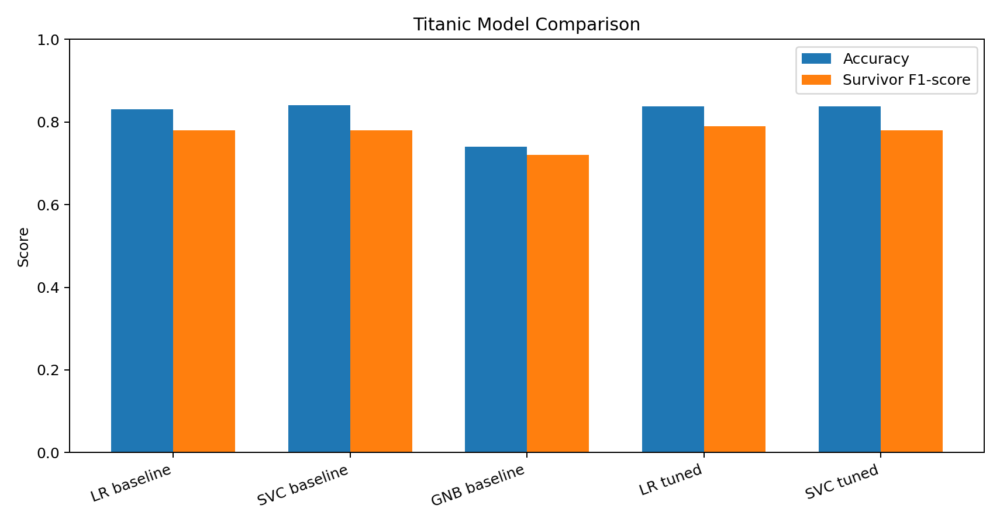

## Hyperparameter Tuning

### Logistic Regression

GridSearchCV selected:

```text
C = 10
penalty = l1
solver = liblinear
```

Final test performance:

| Metric | Value |
|---|---:|
| Test accuracy | 0.83799 |
| Survivor precision | 0.79 |
| Survivor recall | 0.78 |
| Survivor F1-score | 0.79 |

### Support Vector Machine

GridSearchCV selected:

```text
C = 1
gamma = scale
kernel = rbf
```

Final test performance:

| Metric | Value |
|---|---:|
| Test accuracy | 0.83799 |
| Survivor precision | 0.82 |
| Survivor recall | 0.74 |
| Survivor F1-score | 0.78 |

## Interpretation

Both tuned Logistic Regression and tuned SVC reached the same overall test accuracy. Logistic Regression was slightly better for survivor recall and survivor F1-score, while SVC achieved higher survivor precision. Both models are reasonable final candidates depending on whether the priority is catching more survivors or reducing false survival predictions.

## Repository Structure

```text
.
├── titanic_survival_prediction_ml.ipynb
├── src/
│   ├── preprocess.py
│   ├── train.py
│   └── evaluate.py
├── docs/
│   └── figures/
├── results/
│   ├── dataset_summary.json
│   └── model_comparison.csv
├── requirements.txt
├── .gitignore
└── README.md
```

## Run Locally

Create a Python environment and install dependencies.

### Windows PowerShell

```powershell
py -3.10 -m venv .venv
.\.venv\Scripts\Activate.ps1
python -m pip install --upgrade pip
pip install -r requirements.txt
```

### Linux / macOS

```bash
python3 -m venv .venv
source .venv/bin/activate
python -m pip install --upgrade pip
pip install -r requirements.txt
```

## Dataset Setup

Place the Titanic training file at:

```text
data/train.csv
```

The raw dataset is not included in this repository.

## Open the Notebook

```bash
jupyter notebook titanic_survival_prediction_ml.ipynb
```

## Optional Script Usage

Train tuned Logistic Regression:

```bash
python src/train.py --data data/train.csv --model logistic_regression --output-dir outputs
```

Train tuned SVC:

```bash
python src/train.py --data data/train.csv --model svc --output-dir outputs
```

Evaluate a saved model:

```bash
python src/evaluate.py --data data/train.csv --model-path outputs/best_logistic_regression.joblib
```

## Limitations

This project uses the classic Titanic dataset, which is small and historically fixed. Results should be interpreted as a machine learning workflow demonstration rather than a deployable real-world survival prediction system. Additional validation and more data would be needed for broader generalization.

## Future Work

Future improvements include ensemble stacking, calibrated probability outputs, model explainability with SHAP, robust pipeline packaging, and additional cross-validation diagnostics.
